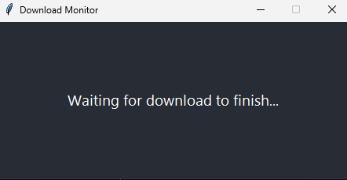
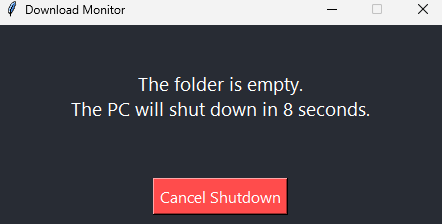

# Steam Auto Shutdown (Beta)

A simple app that automatically shuts down your PC once Steam finishes downloading.  
Perfect for overnight downloads — so you don’t have to worry about leaving your PC on all night.  
It includes a 10-second countdown with a cancel button, so you always stay in control.

---

## Features

- Detects when your Steam download folder is empty  
- 10-second shutdown countdown with an easy cancel option  
- Lightweight and clean GUI built with Tkinter  
- Open source and easy to customize

---

## How to use

1. Download and run the [`auto-shutdown.exe`](https://github.com/wilidretsi/AutoShutdown-for-Downloads/releases/tag/v1.0.0) from the Releases (no need to install Python).  
2. The app monitors your Steam downloads folder quietly in the background.  
3. When downloads finish, a countdown starts and your PC will shut down — unless you cancel it.

---

## Beta Notice

Heads up! This is a beta version, so some bugs might pop up.

---

## Want to help?

Found a bug or have ideas to improve it? Open an issue or a pull request here on GitHub — every bit of feedback helps!

---

## License

MIT License — see the [LICENSE](LICENSE) file for details.

---

# Changelog

## v1.0.0 - 2025-07-22
- Initial beta release with shutdown on Steam download finish.
- Countdown and cancel button.

---

Made with ❤️ by wilidretsi
